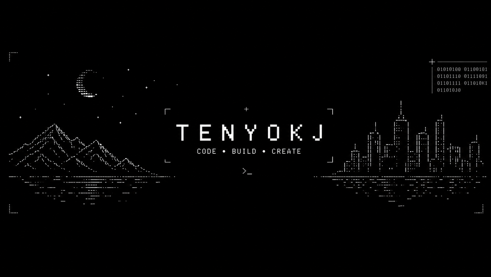
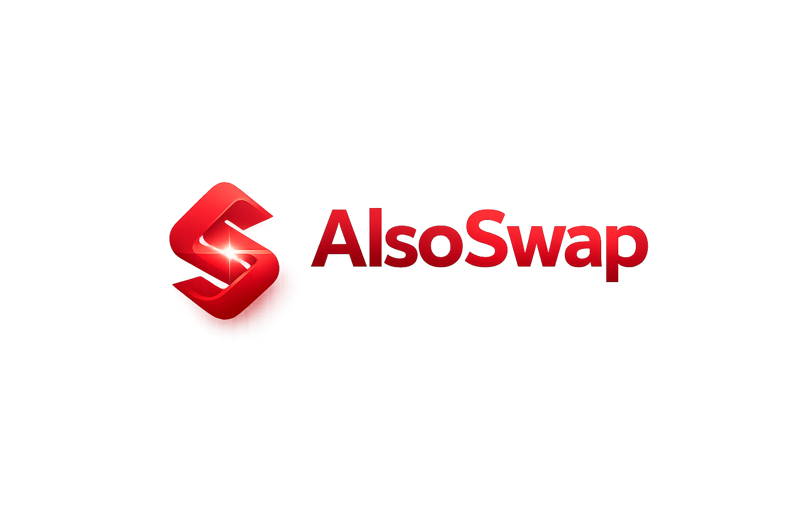

<h1 align="center">Tenyokj 👋</h1>

Solidity Developer • Web3 Builder • DAO Infrastructure

Building real on-chain systems and Web3 products.

---

## ❤️‍🔥 My Vibe Statement

I love the moment when after a long day you sit down at your desk, open your laptop, and start building.

Writing smart contracts, committing code, pushing changes — that's real relaxation.

---

---

# 🚀 About Me

Solidity developer focused on **building real blockchain infrastructure**.

My main interest is designing **on-chain systems that communities can use to coordinate and build together.**

Currently focused on:

• DAO infrastructure
• Smart contract architecture
• DeFi protocol design
• Full-stack Web3 applications

---

# 🧰 Tech Stack

### Blockchain

### Frontend

### Backend / Languages

---

# 🚀 Core Projects

<table>
<tr>
<td width="50%">

## 🟡 BERT DAO

Upgradeable **DAO governance & grant protocol**.

BERT turns community proposals into **funded outcomes on-chain**.

### Key Features

• proposal → voting → funding → distribution
• reputation & voter progression system
• upgradeable core modules
• role-based governance permissions

### Use Cases

• DAO grant programs
• ecosystem funding rounds
• hackathon builder rewards

🔗 Links

Core Contracts
https://github.com/tenyokj/bert-core

Docs Repo
https://github.com/tenyokj/bert-docs

Documentation
https://bertdao-docs.vercel.app

Website
https://bertdao.vercel.app

</td>

<td width="50%">

## 🔵 AlsoSwap Protocol

Upgradeable **AMM DEX protocol for DAO tokens**.

AlsoSwap provides a full on-chain stack for:

• token listing
• liquidity provisioning
• token swapping

### Key Features

• constant-product AMM pools
• Router & RouterV2 swaps
• flash swap mechanics
• TWAP oracle pricing
• timelocked governance controls

### What You Can Do

• create ERC20 pools
• provide liquidity and earn fees
• swap tokens through router
• integrate TWAP price feeds

### Roadmap

• advanced multi-hop routing
• deeper liquidity ranking
• analytics dashboards
• SDK + frontend integration

🔗 Protocol Repo
https://github.com/tenyokj/alsoswap-core

</td>
</tr>
</table>

---

# 🧠 What I Like Building

• DAO governance systems
• DeFi protocols
• upgradeable smart contract architectures
• on-chain coordination tools

---

# 🧪 Smart Contract Development

My workflow focuses on **secure and well-tested contracts**.

Tools I regularly use:

• Hardhat
• OpenZeppelin upgradeable contracts
• test fixtures
• high-coverage test suites

---

# 📊 Github Stats

---

# 📈 Contribution Graph

---

# 💼 Portfolio

🌐 https://tenyokj.vercel.app

---

# 🤝 Let’s Connect

Always open to collaboration on:

• Web3 projects
• DAO infrastructure
• protocol development
• startup ideas

---

Building the next generation of Web3 infrastructure 🚀

